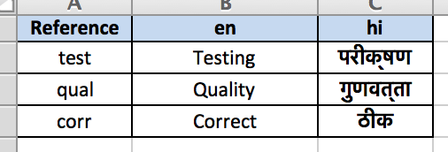
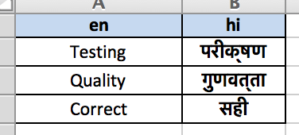

### Localization of Strings

As a part of automating tests, a test author might need to deal with localization of strings that are used for various purposes.

Arjuna supports Excel based localization data out of the box. These files are automatically loaded when `Arjuna.init()` is called by Arjuna launcher.

**Sample Localization File**

The localization file follows the format of Excel Column Data Reference files.

You place such files in `<Project Root>/data/l10/excel` directory. Two reference files can be found in this example project.



First column is always the English language column. The other columns represent the other languages mentioned as `Locale` type in column heading.

In the example file, the column mentions `hi` which is Locale value for Hindi.

For demonstration purpose, 3 English words are provided with corresponding strings in Hindi.



The second file `sample2.xls` has the same data except the localized string for `Correct` in Hindi which is different from `sample1.xls`.

#### The `L` function for Localization

```python
# arjuna-samples/arjex_core_features/test/module/check_14_dd_localizer.py

from arjuna import *


@test
def check_excel_localizer(request):
    print(L("Testing"))
    print(L("Quality", locale=Locale.HI))

    print(L("Correct"))
    print(L("Correct", bucket="sample1"))
    print(L("Correct", bucket="sample2"))
```

#### Points to Note
1. Arjuna provides a special function `L` for localizing a string.
2. `L("Testing")` localizes the string as the `ArjunaOption.LOCALE` value in reference configuration.
3. You can also explcitily mention the locale as `Locale.HI`.
4. When a name is repeated across multiple localization files (buckets), the last one holds. `L("Correct")` will give the value from `sample2` file as it is loaded after `sample1`.
5. You can explcitily refer to a bucket by providing the `bucket` argument. Each Excel localization file represents a bucket and its name without the extension is the bucket name.
