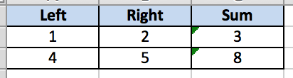

### Driving with Data Files

For large, static data it might be useful to externalize the data completely outside of Python code.

Arjuna supports data externalization in XLS, TSV/CSV and INI files out of the box.

```python
# arjuna-samples/arjex_data/test/module/check_08_dd_data_files.py

from arjuna import *

@test(drive_with=data_file("input.xls"))
def check_drive_with_excel(request, data):
    request.asserter.assert_equal(int(data.left) + int(data.right), int(data.sum), "Calculation failed.")

@test(drive_with=data_file("input.txt"))
def check_drive_with_tsv(request, data):
    request.asserter.assert_equal(int(data.left) + int(data.right), int(data.sum), "Calculation failed.")

@test(drive_with=data_file("input.csv", delimiter=","))
def check_drive_with_csv(request, data):
    request.asserter.assert_equal(int(data.left) + int(data.right), int(data.sum), "Calculation failed.")

@test(drive_with=data_file("input.ini"))
def check_drive_with_ini(request, data):
    request.asserter.assert_equal(int(data.left) + int(data.right), int(data.sum), "Calculation failed.")
```

For the above code to work, there are sample files provided in the directory `<Project Root>/data/source`.

**input.xls**



**input.txt**

```text
Left	Right	Sum
1	2	3
4	5	8
```

**input.csv**

```text
Left,Right,Sum
1,2,3
4,5,8
```

**input.ini**

```ini

[Record 1]
Left = 1
Right = 2
Sum = 3

[Record 2]
Left = 4
Right = 5
Sum = 8
```

##### Points to Note
1. The files are automatically picked up from `Data Sources directory` which is `<Project Root>/data/source`.
2. We use `data_file` builder function to specify a data file. Arjuna determines the loader based on the file extension.
3. `.txt` extension indicates a file with `tab-separated` values.
4. You can specify a custom delimiter by using the `delimiter` argument.

#### Data Files with Exclude Filter for Records

At times, you might want to selectively mark records in data files to be excluded from consideration.

```python
# arjuna-samples/arjex_data/test/module/check_09_dd_data_files_filter.py

from arjuna import *

from arjuna import *

@test(drive_with=data_file("input_exclude.xls"))
def check_drive_with_excel(request, data):
    request.asserter.assert_equal(int(data.left) + int(data.right), int(data.sum), "Calculation failed.")

@test(drive_with=data_file("input_exclude.txt"))
def check_drive_with_tsv(request, data):
    request.asserter.assert_equal(int(data.left) + int(data.right), int(data.sum), "Calculation failed.")

@test(drive_with=data_file("input_exclude.ini"))
def check_drive_with_ini(request, data):
    request.asserter.assert_equal(int(data.left) + int(data.right), int(data.sum), "Calculation failed.")
```

For the above code to work, there are sample files provided in the directory `<Project Root>/data/source`.

**input_exclude.xls**


**input_exclude.txt**

```text
Left	Right	Sum
1	2	3
#4	5	8
```

**input_exclude.ini**

```ini

[Record 1]
Left = 1
Right = 2
Sum = 3

;[Record 2]
;Left = 4
;Right = 5
;Sum = 8
```

##### Points to Note
1. You can include a column named `exclude` and set it to `y/yes/true` to exclude a record.
2. You can do this for XLS/DSV/INI files.
3. For delimiter-separated-files, you can also comment a record by putting a `#` at the beginning.
4. For INI files, you can also comment a complete record by using `;` which is the commenting symbol for INI files.
